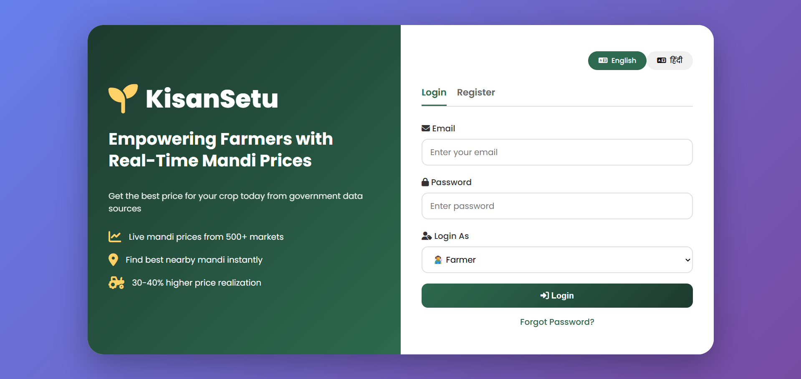
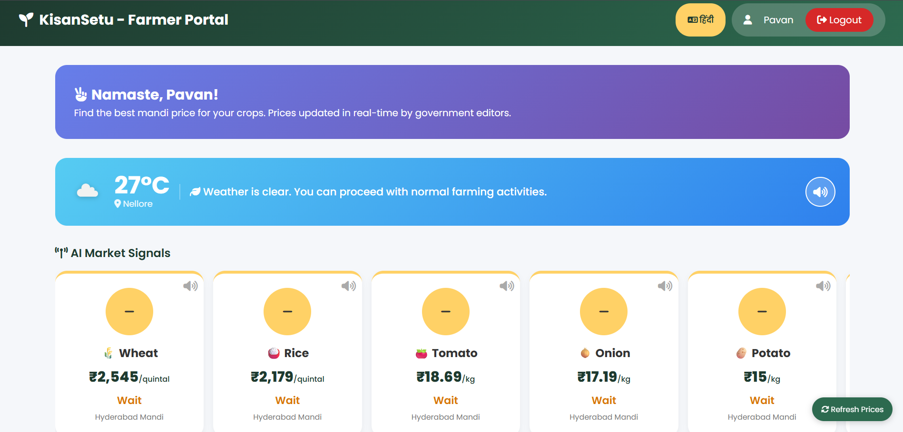
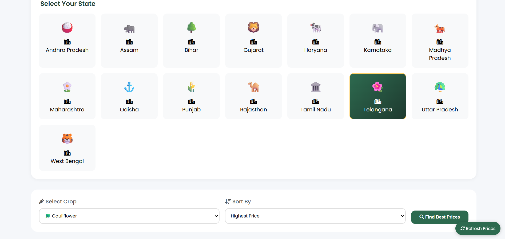
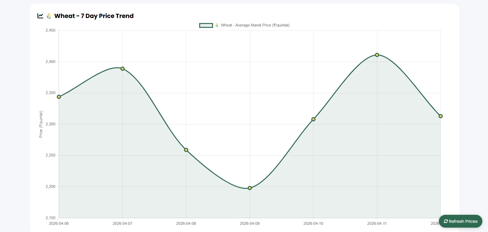
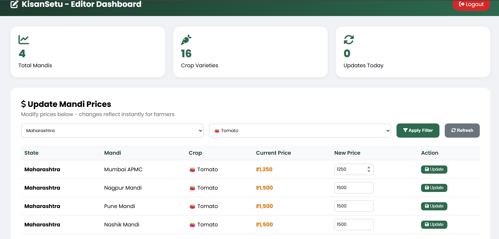

# 🌾 KisanSetu - Farmer Mandi Price Aggregator

## 🚜 Overview

KisanSetu is a web-based platform that helps farmers find the best mandi prices for their crops using real-time data.

## 💡 Problem

Farmers often sell crops at lower prices due to lack of market visibility and access to real-time data.

## ✅ Solution

This system provides:

* Live mandi price tracking
* Crop-based filtering
* Easy-to-use dashboards
* Better decision-making support for farmers

## 🛠️ Tech Stack

* Node.js
* Express.js
* HTML, CSS, JavaScript

## 📂 Project Structure

```
kisan-setu-project/
├── frontend/
│   ├── index.html
│   ├── farmer-dashboard.html
│   ├── editor-dashboard.html
│
├── backend/
│   ├── data/
│   ├── server.js
│   ├── package.json
│   ├── package-lock.json
```

## ▶️ How to Run

1. Go to backend folder:

```
cd backend
npm install
npm start
```

2. Open frontend:

* Open `frontend/index.html` in your browser

## 🌐 Features

* Farmer dashboard for price viewing
* Editor dashboard for managing data
* Mandi price tracking system
* Simple and user-friendly interface

## 📸 Screenshots

### Home Page



### Farmer Dashboard (Part 1)



### Farmer Dashboard (Part 2)



### Farmer Dashboard (Part 3)



### Editor Dashboard



## 🚀 Future Improvements

* Real-time API integration (Agmarknet)
* Mobile application version
* AI-based crop price prediction
* Location-based mandi suggestions

## 👨‍💻 Author

Gonemoni Nikhil
